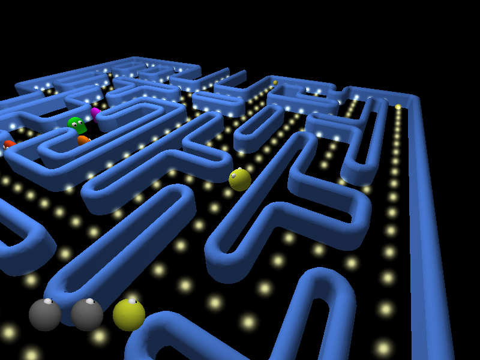

# PacMan Arena

This was made by a student (subtil, subtil@student.dei.uc.pt) and posted on sourceforge.
The game is mostly playable but isn't entirely finished.
It's still good for quick play sessions though and is quite fun.

# Controls (GCW0/RG350)

A : Shoot missile/Confirm
B : Drop bombs

Select : Exit

# Graphics

Export as TGA without RLE Compression and Top Left Origin

# Status

Linux x64 : Working

GCW0/RG-350 : Gets to the titlescreen but when starting a game, it crashes 3 seconds after.
